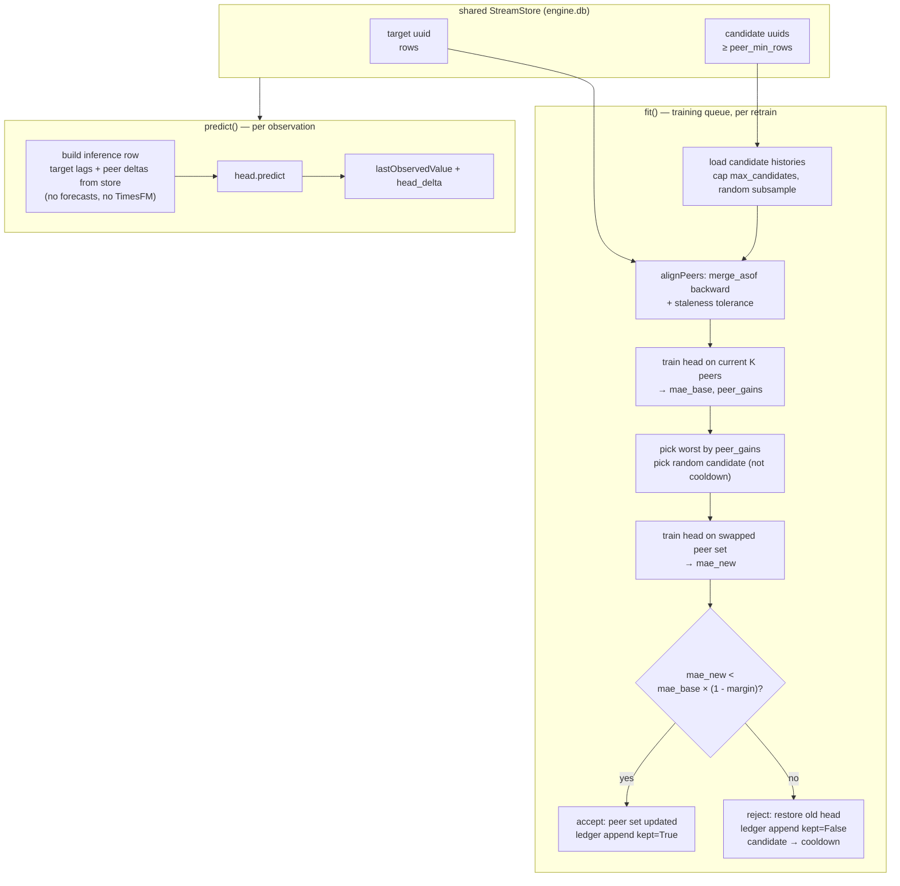

# Jordan-1: Multivariate Prediction with Random-Swap Peer Search

Alternative to [`MULTIVARIATE.md`](./MULTIVARIATE.md). Same goal — use peer data
streams as features to improve target prediction — with a simpler stack and an
explicit exploration loop over the peer set.

> Status: design/roadmap only. Nothing here is implemented yet. All file/line
> references were verified against the same unified engine as MULTIVARIATE.md.

---

## 1. Relation to MULTIVARIATE.md

The upstream design (TimesFM-stacked features with correlation top-K peer
selection) is well thought-out but adds two moving parts the MVP does not need:

- **TimesFM as a feature engine.** The predicted-covariate training scheme
  (peer `shift(-1)` at train time, TimesFM forecast at inference) requires
  TimesFM residency (~2 GB RAM gate), a process-wide inference lock, per-epoch
  forecast caching, and careful handling across the 2-step autoregression.
  Architecture the head model has to work around.
- **Correlation top-K peer selection.** Peer picking is greedy on Pearson
  correlation of deltas — a static heuristic, with no experimental validation
  that a picked peer actually helped and no memory of which peers have been
  tried on this target.

Jordan-1 keeps everything about MULTIVARIATE.md that stands on its own
(alignment, deepcopy safety, fallback chain, data-quality guards, `condition()`
gates, persisted schema envelope, the existing stub as the home file) and
replaces those two parts with:

1. **XGBoost head only.** No TimesFM at feature construction time. Peer
   next-step values are not part of the feature schema; only observed peer
   deltas and target lags.
2. **Random-swap peer search with a persisted ledger.** On each retrain,
   identify the least-useful peer in the current set, swap it for a random
   candidate, retrain, and either keep or revert based on test MAE. Record
   every attempt so the adapter can learn from its own exploration and avoid
   retrying rejected peers.

Everything else — file layout, adapter interface, engine wiring, deepcopy
rules, persistence location — is unchanged from MULTIVARIATE.md §3.4.

---

## 2. Design

### 2.1 Feature schema (v1)

Simpler than MULTIVARIATE.md §3.3: no `p{k}_next`, no `shift(-1)`, no
substitution between train and serve.

| Feature | Definition | Source at both train and inference |
|---|---|---|
| target lags | pct-change at lags [1, 2, 3, 5, 8] | observed |
| `p{k}_delta_0` | peer k pct-change, t-1 to t | observed (aligned) |
| `p{k}_delta_1` | peer k pct-change, t-2 to t-1 | observed (aligned) |
| label `y` | target level diff, t to t+1 | observed |

Two peer columns per peer (current change + one lag) capture both "the peer is
moving" and "the peer just moved". No forecast of the peer at t+1 enters the
schema, so nothing degrades semantically between train and serve. Train MAE
and inference MAE are drawn from the same feature distribution.

Alignment, staleness tolerance, NaN → 0.0 fill, delta target rationale
(~30% pooled MAE improvement over level target per XGB v2 benchmark), leakage
invariants, near-duplicate exclusion (`|corr| > 0.995`), and constant-peer
exclusion: identical to MULTIVARIATE.md §3.2–3.3. All still apply.

### 2.2 Peer selection: random-swap-worst loop

Replaces MULTIVARIATE.md §3.2. The adapter maintains a working set of K peers
(default K=5) and evolves it one swap at a time on the training queue.

**Initial peer set (first fit):**

Pick K peers uniformly at random from the candidate pool. Candidate pool =
every uuid in `StreamStore` with ≥ `peer_min_rows` rows, minus the target,
minus any `_pred` stream, minus zero-variance peers, minus streams in the
cooldown table.

Warm-start alternative (opt-in): initial K = correlation top-K
(MULTIVARIATE.md §3.2). Faster convergence when the store is large; skips the
"random early cycles" phase. Off by default so the exploration audit trail is
honest — turn it on for production, off for measuring the search itself.

**Retrain step (one swap per cycle):**

1. **Train baseline head** on the current peer set with fixed seed; get
   `mae_base` from the chronological 80/20 test split.
2. **Score each peer** by XGBoost feature gain
   (`booster.get_score(importance_type='gain')`), summed across that peer's
   `p{k}_delta_*` columns. Lowest total gain = weakest peer. Break ties
   deterministically (oldest peer in set, then uuid order).
3. **Pick a candidate at random** from the eligible pool (excluding current
   peers, self, `_pred`, cooldown).
4. **Swap: remove weakest, add candidate.** Rebuild the training matrix on the
   new peer set. Train a fresh head with the same fixed seed; get `mae_new`.
5. **Accept criterion:** keep the swap iff
   `mae_new < mae_base * (1 - keep_margin)`, default `keep_margin = 0.01`
   (1% improvement). Below this margin the delta is noise at ~60 training rows.
6. **On accept:** peer set updated. Old peer moved to `retired_peers` (with
   the row count at retirement, for later analytics). New peer added to
   `active_peers`. Append ledger entry with `kept=True`.
7. **On reject:** discard the new head, restore prior head and peer set. New
   peer moved to `cooldown` with a decay window (`cooldown_rows` target rows
   before re-eligibility). Append ledger entry with `kept=False`.

Reproducibility: `XgbHead` fixes `random_state` and uses `subsample=1.0` (or a
fixed seed if subsampling is on), so `mae_base` ↔ `mae_new` isolate the peer
swap. Alignment and split boundaries are deterministic on the same target row
count.

Cost: one extra head fit per target per retrain — cheap for XGB at ~60 rows.
Single-worker training queue (MULTIVARIATE.md §5.3) means this queues like
everything else and never blocks predicts for other targets.

**First-cycle bootstrap.** On the very first fit no prior gains exist, so the
swap step is skipped: just train once on the initial K peers, record
`mae_base` in the ledger with `swapped_in = swapped_out = None`,
`reason = 'initial'`. From cycle 2 onward the loop runs normally.

### 2.3 Persisted state (schema_version = 2)

Joblib at `modelPath()`, mirroring MULTIVARIATE.md's format with added
exploration state:

```python
{
    'schema_version': 2,
    'head_name': 'xgboost',
    'head_state': dict,             # picklable XGB booster
    'peer_uuids': list[str],        # active peer set (length K)
    'peer_gains': dict[str, float], # last feature-gain score per active peer
    'feature_columns': list[str],
    'staleness_seconds': float,
    'modelError': float,            # current test MAE (after last accepted state)
    'selected_at_rows': int,
    'swap_ledger': list[dict],      # append-only, LRU-capped at max_ledger_entries
    'cooldown': dict[str, int],     # peer -> target-row-count when re-eligible
    'retired_peers': dict[str, int], # peer -> target-row-count when retired
}
```

Each `swap_ledger` entry:

```python
{
    'at_rows': int,               # target row count at retrain time
    'swapped_out': str | None,    # uuid removed (None on initial fit)
    'swapped_in': str | None,     # uuid added (None on initial fit)
    'prev_test_mae': float,
    'new_test_mae': float,
    'kept': bool,
    'reason': str,                # 'initial' | 'margin' | 'no_improvement'
}
```

The ledger gives three things the correlation approach cannot:

- **Audit.** Any user (or a future analytics job) can inspect what was tried
  and what worked, per target.
- **Cooldown memory.** Rejected peers do not get retried until enough new
  target rows have accumulated to make the comparison meaningfully different.
- **Learning signal for later work.** A future policy could weight candidate
  selection by prior success rate across all target models — "peer X has been
  kept 12 times across 40 attempts on different targets" is a warm prior.

Ledger cap: default 200 entries, LRU by `at_rows`. Above ~60 accepted keeps
per target the marginal information is low.

`load()` refuses `schema_version` mismatches and returns None (same pattern as
MULTIVARIATE.md §3.4 — clean retrain on any format change).

### 2.4 Adapter architecture and file layout

Same as MULTIVARIATE.md §3.4. Files:

| File | Change |
|---|---|
| `adapters/multivariate/heads.py` | NEW — head interface + `XgbHead` (unchanged from original doc; fixed conservative params, deterministic seed) |
| `adapters/multivariate/features.py` | NEW — `alignPeers`, `buildFrame`, guards. No `selectPeers` (correlation) and no `buildInferenceRow` covariate-substitution helper |
| `adapters/multivariate/peer_search.py` | NEW — `initialPeers`, `pickWorstPeer`, `pickCandidate`, `evaluateSwap`, `ledgerAppend`, `cooldownFilter` |
| `adapters/multivariate/multivariate.py` | REWRITE the stub (currently has inverted `condition()`) |
| `adapters/multivariate/__init__.py` | FIX (currently imports `StarterAdapter`) |
| `adapters/__init__.py` | Guarded optional import, same pattern as TimesFM |
| `engine.py` | Two lines: import + `ADAPTER_REGISTRY['multivariate']` |
| `satoriengine/stream_store.py` | One method: `count_streams_with_min_rows(min_rows)` (single `GROUP BY ... HAVING`) |

`condition()` gates: as in MULTIVARIATE.md §3.4, **minus the RAM gate**. No
TimesFM residency requirement means no 2 GB threshold. Keep:

- target rows < 60 → 0.0
- fewer than 2 streams with ≥ 30 rows in the store → 0.0 (single-SQL count
  behind a ~60s TTL cache)
- any store exception → 0.0

`fit()` flow: per §2.2 above. Deepcopy safety and no-connection-holding rules
identical to MULTIVARIATE.md — head state, peer uuids, gains, ledger,
cooldown, and feature columns are all picklable; no sqlite connections held.

`predict()` flow: no TimesFM call, no per-epoch peer-forecast cache. Build the
inference row from `StreamStore` peer values + target lags; ship
`lastObservedValue + head_delta`. The 2-step autoregression (`_runForecast`
calling `predict` twice, `engine.py:1154`) is handled by feeding the first
prediction back as a synthetic row exactly as `TimesFmAdapter` does; peer
values on the augmented step use the last observed peer value (no forecast),
which is the same regime the head already saw whenever a peer was stale in
training.

**Config** (all optional, defaults in code):

```yaml
engine:
  preferred_adapter: multivariate
  multivariate:
    head: xgboost
    top_k: 5                 # K
    peer_min_rows: 30
    keep_margin: 0.01        # min fractional MAE improvement to accept swap
    cooldown_rows: 100       # target rows before rejected peer is re-eligible
    max_candidates: 50       # cap on candidate pool per fit (random subsample if larger)
    max_ledger_entries: 200
    warm_start: false        # if true, seed initial K with correlation top-K
```

---

## 3. What we keep by reference from MULTIVARIATE.md

Applies unchanged. Do not re-read below if you have the original open.

- **§2 (readiness hooks).** StreamStore singleton, adapter-per-target
  construction (`self.adapter(uid=self.streamUuid)`), deepcopy path, existing
  stub location, registry conventions.
- **§3.3 alignment rules.** `merge_asof(direction='backward')` with staleness
  tolerance (default 3× median cadence), NaN → 0.0 fill, leakage invariants,
  delta target rationale.
- **§3.4 deepcopy safety and persistence pattern.** No sqlite connections in
  adapter state; joblib at `modelPath()`; schema mismatch → return None →
  clean retrain.
- **§5.1 peer data acquisition constraint.** Relays hold only the latest
  observation per stream (kind 34601 is parameterized-replaceable), so peer
  history must be accumulated by subscribing. The warm pool (auto-subscribe
  top-N free non-gated streams) remains valid future work; for MVP, use only
  what is already in the local `StreamStore`. The publisher-served history
  protocol sketch (§5.1 "option 2") remains a valuable future accelerator and
  is independent of this design.
- **§5.3 contention analysis.** Training queue is single-worker; no
  cross-target blocking beyond that. With TimesFM removed, the process-wide
  inference lock is no longer a concern for this adapter.
- **§5.4 peer death / silence.** Staleness tolerance handles silent peers.
  The random-swap loop naturally rotates dead peers out: their gain collapses
  to ~0 (constant NaN → 0.0 column), they are picked as "worst", and the next
  candidate replaces them.
- **§5.5 edge cases.** All data-quality guards: near-duplicate exclusion,
  zero-variance peer NaN handling, duplicate timestamps, future-timestamp
  drop, winsorization, XGB non-finite guards, missing peer uuids, corrupt
  model file, empty store, and the engine's Starter-fallback safety net
  (`_runForecast` → `producePrediction` → `fallback_prediction`).

---

## 4. What we drop from MULTIVARIATE.md

- `p{k}_next` feature (peer forecast). Not in the schema.
- Predicted-covariate training scheme (`shift(-1)` at train, forecast at
  serve). Not needed — feature schema is symmetric between train and serve.
- TimesFM integration in the multivariate path (`TimesFmAdapter._ensureModel`,
  `_inference_lock`, per-epoch forecast cache). Not called.
- 2 GB RAM gate in `condition()`. TimesFM is not resident on account of this
  adapter.
- Correlation top-K selection (`selectPeers` by |corr| of aligned deltas).
  Replaced by random-swap-worst.
- `peer_corrs` in persisted state. Replaced by `peer_gains` (last-fit XGB
  feature gain per peer).

Net code impact vs. MULTIVARIATE.md: one file removed
(`features.py::selectPeers`) and one adapter-wiring block removed (TimesFM
plumbing in `predict`). One file added (`peer_search.py`: ledger + swap loop).
Roughly net-flat on line count, meaningfully smaller runtime surface.

---

## 5. Data flow



Compare to MULTIVARIATE.md §4: the TimesFM subgraph, the peer-forecast cache,
and the correlation-selection subgraph are all gone. What remains is the
straight adapter path plus a per-fit ablation swap.

---

## 6. Testground and go/no-go gate

Reuse the plan from MULTIVARIATE.md §6 (roadmap step 3), extended with the new
variants. Walk-forward the last ~20 points of each of the 80 real streams in
`engine-lite/db/engine.db`. Compare pooled MAE and per-stream win rate of:

1. Naive last-value.
2. Univariate `XgbAdapter`.
3. Multivariate correlation top-K (from MULTIVARIATE.md, variant (d) — with
   TimesFM peer forecasts).
4. Multivariate correlation top-K, naive peer covariates (MULTIVARIATE.md
   variant (c) — top-K but peer next = peer last observed).
5. **Multivariate random-swap (this doc), cold start** — initial K random.
6. **Multivariate random-swap (this doc), warm start** — initial K =
   correlation top-K.

The comparisons that matter:

- **(5) vs. (2).** Does random-swap ever beat univariate at 80 real streams?
  If not, this design is not worth shipping.
- **(5) vs. (4).** Does the exploration loop discover peers correlation would
  have missed? Isolates the search vs. the heuristic.
- **(6) vs. (4).** With the same initial peers, does the swap loop improve on
  static top-K over cycles?
- **(3) vs. (6).** Does TimesFM add real value on top of the same peer set?
  Guides whether TimesFM comes back later as an optional enhancement.

The random-swap loop has a per-target learning curve — early cycles bounce as
bad initial peers cycle through. Measure MAE at cycle counts {5, 15, 50} to
see convergence, not only steady-state.

---

## 7. Roadmap

1. **Pure functions.** `features.py` (alignment, frame build, guards) +
   `peer_search.py` (initial pick, worst pick, candidate pick, ledger append,
   cooldown). Unit checks: leakage invariants at row t; cooldown decay;
   ledger cap; ties in gain broken deterministically; empty candidate pool
   returns a well-formed "no swap" outcome, not a crash.
2. **Adapter + wiring.** Rewrite the stub. Fix `__init__.py`. Registry entry.
   Config keys. `count_streams_with_min_rows` on `stream_store.py`. Lifecycle
   checks: `copy.deepcopy(fitted_adapter)` works; joblib round-trip; `load`
   refuses schema mismatch (including MULTIVARIATE.md's schema_version=1).
3. **Backtest testground.** Section 6 above; go/no-go gate.
4. **Dev-neuron integration.** `preferred_adapter: multivariate` on a dev
   node. Selection at ≥ 60 target rows with ≥ 2 candidate streams. Ledger
   inspection endpoint (dump most recent N ledger entries for a target uuid
   as JSON, for eyeballing what the loop is doing).
5. **Warm pool (deferred, from MULTIVARIATE.md §6 step 5).** Auto-subscribe
   top-N free, non-gated streams so peer coverage grows in the background.
6. **Later.**
   - Reintroduce TimesFM as an optional peer-forecast feature-engine variant,
     gated on RAM and a testground win over the current baseline.
   - **Global peer-success prior.** Aggregate ledgers across targets to
     warm-start `pickCandidate` toward peers that have historically been
     kept. This is exactly the pooled learning MULTIVARIATE.md §6 "future
     work" points at, but built on the ledger rather than on training data.
   - **Per-target adaptive K.** Grow K when swaps keep accepting, shrink when
     they keep rejecting. Trivial policy on top of the existing ledger.

---

## 8. Risks and open questions

1. **Exploration cost vs. store size.** Random pick from N candidates
   converges slowly for large N. The candidate cap
   (`max_candidates = 50`, random subsample) bounds the per-fit work, but a
   store with 5,000 relay streams needs many retrain cycles to explore even
   a fraction. Cooldown (100 target rows before retry) at 10-minute cadence
   means ~17 hours between reconsideration of any given rejected peer —
   acceptable for a slowly-improving background search, but bad candidates
   still cost a full ablation cycle to reject.
2. **MAE variance at ~60 rows.** A single peer swap may move test MAE by
   less than the noise across a train/test split. `keep_margin = 0.01`
   guards against noise but is a guess; the testground should sweep
   `keep_margin ∈ {0, 0.005, 0.01, 0.02, 0.05}` and pick the smallest that
   gives a stable-vs.-churning peer set on real data.
3. **XGB feature gain noise at small K.** With K=5 peers × 2 lag columns =
   10 peer features, per-peer gain sums are estimated on ~48 training rows.
   Ties or near-ties will happen; break them deterministically (oldest peer
   in set, then uuid order), and consider an epsilon band that falls back to
   "oldest peer" as the worst.
4. **Ledger vs. code drift.** If `keep_margin` or the feature schema changes,
   past ledger entries stop being comparable to new ones. Bump
   `schema_version`; new state resets the ledger on load rather than mixing
   eras.
5. **No principled cold-start.** Random K on first fit will underperform
   correlation top-K for the first few cycles. Warm-start config exists but
   blurs the audit trail. Accept the transient cost during backtest, and
   consider shipping warm-start on by default once the correlation branch is
   validated by the testground.
6. **Interaction with the univariate fallback.** If the multivariate MAE is
   worse than univariate for a target, the engine has no cross-adapter
   comparison — it keeps running multivariate. A future addition could
   compare `modelError` across adapters on the same target and fall through;
   out of scope here.
7. **No principled attribution when multiple peers change together.** This
   design commits to exactly one swap per cycle so attribution is clean. A
   later variant that swaps multiple peers per cycle for faster exploration
   would need a real ablation (leave-one-out over the changed set) to
   attribute the MAE delta — much more expensive. Not planned for MVP.
