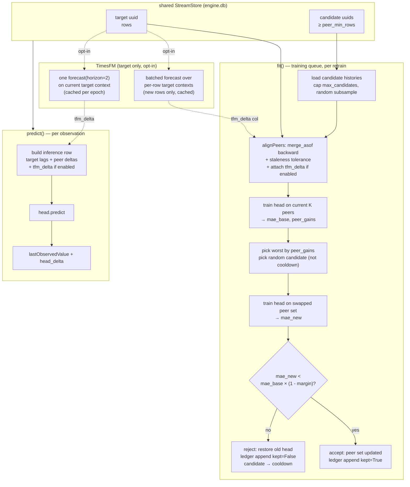

# Jordan-1: Multivariate Prediction with Random-Swap Peer Search

Alternative to [`MULTIVARIATE.md`](./MULTIVARIATE.md). Same goal — use peer
data streams as features to improve target prediction — with a simpler stack,
an explicit exploration loop over the peer set, and a **targeted, opt-in** use
of TimesFM (as a feature engine on the response variable only, not on peers).

> Status: design/roadmap only. Nothing here is implemented yet. All file/line
> references were verified against the same unified engine as MULTIVARIATE.md.

---

## 1. Relation to MULTIVARIATE.md

The upstream design (TimesFM-stacked peer features with correlation top-K peer
selection) is well thought-out but couples two heavy moving parts to every
prediction:

- **TimesFM on every peer.** The predicted-covariate training scheme (peer
  `shift(-1)` at train time, TimesFM forecast at inference) requires TimesFM
  residency (~2 GB RAM gate), a process-wide inference lock held for
  K-series-per-target on every predict, per-epoch forecast caching keyed on
  peer sets, and careful handling across the 2-step autoregression.
- **Correlation top-K peer selection.** Peer picking is greedy on Pearson
  correlation of deltas — a static heuristic, with no experimental validation
  that a picked peer actually helped and no memory of which peers have been
  tried on this target.

Jordan-1 keeps everything about MULTIVARIATE.md that stands on its own
(alignment, deepcopy safety, fallback chain, data-quality guards, `condition()`
gates, persisted schema envelope, the existing stub as the home file) and
replaces those two parts with:

1. **XGBoost head, with TimesFM as an opt-in target-only feature engine.**
   Peer forecasts are NOT in the schema — no `p{k}_next`, no covariate
   substitution. When enabled, TimesFM is applied only to the response
   variable: a rolling one-step forecast of the target itself becomes one
   additional feature the head can weigh against the rest. Per predict cost
   is one series (not K), per fit is one batched call across training rows
   plus an incremental cache thereafter.
2. **Random-swap peer search with a persisted ledger.** On each retrain,
   identify the least-useful peer in the current set, swap it for a random
   candidate, retrain, and either keep or revert based on test MAE. Record
   every attempt so the adapter can learn from its own exploration and avoid
   retrying rejected peers.

Everything else — file layout, adapter interface, engine wiring, deepcopy
rules, persistence location — is unchanged from MULTIVARIATE.md §3.4.

The TimesFM choice deserves a note. There are three reasonable places TimesFM
can enter this design:

| Where | Cost per predict | What the head learns | Verdict |
|---|---|---|---|
| Forecast every peer (MULTIVARIATE.md) | K TimesFM calls under one lock | peer next-step deltas as features | Expensive; K× lock contention; peer inference tied to TimesFM availability |
| Forecast the target only (this doc, opt-in) | 1 TimesFM call | "TimesFM says target delta is X — how much do I trust that vs. peers?" | Cheap; 1× lock; feature stands independently and can be turned off without touching peers |
| Split into two adapters (`mv`, `mv-tfm`) | 0 or K | — | Reasonable but doubles maintenance surface for MVP |

Target-only is the strongest simple-integration lever: TimesFM contributes a
single high-quality baseline column that XGBoost can trust or ignore per
stream, without touching peer semantics or making every peer's inference path
dependent on the TimesFM lock. That is the integration this doc adopts.

---

## 2. Design

### 2.1 Feature schema (v1)

Simpler than MULTIVARIATE.md §3.3: no `p{k}_next`, no `shift(-1)` on peers,
no substitution between train and serve for peer features.

| Feature | Definition | Source at train | Source at inference |
|---|---|---|---|
| target lags | pct-change at lags [1, 2, 3, 5, 8] | observed | observed |
| `p{k}_delta_0` | peer k pct-change, t-1 to t | observed (aligned) | observed (aligned) |
| `p{k}_delta_1` | peer k pct-change, t-2 to t-1 | observed (aligned) | observed (aligned) |
| `tfm_delta` (optional) | TimesFM one-step forecast of the TARGET, expressed as `(forecast_next - target_now) / target_now` | rolling one-step-ahead across training window, one batched TimesFM call over per-row contexts | one TimesFM call using target history up to current epoch |
| label `y` | target level diff, t to t+1 | observed | (predicted) |

Two peer columns per peer (current change + one lag) capture both "the peer
is moving" and "the peer just moved". No forecast of any peer at t+1 enters
the schema, so nothing degrades semantically between train and serve for peer
features.

`tfm_delta` is off by default (`use_tfm_on_target: false`); when on, it adds
one high-signal feature that the head decides how to weight against target
lags and peer deltas. Full construction below (§2.1.1).

Alignment, staleness tolerance, NaN → 0.0 fill, delta target rationale
(~30% pooled MAE improvement over level target per XGB v2 benchmark),
leakage invariants, near-duplicate exclusion (`|corr| > 0.995`), and
constant-peer exclusion: identical to MULTIVARIATE.md §3.2–3.3. All still
apply.

### 2.1.1 Constructing `tfm_delta` (opt-in)

The user-facing question was: "how do we get value out of TimesFM without
paying for it on every peer?" Answer: apply it only to the target, treat its
forecast as a feature the head evaluates alongside the peer signals it has
already selected.

**At training.** For each training row t (t ≥ `tfm_min_context`, default
32), the context is the target's own history *up to and including* t. Build
N inputs (variable-length target histories, one per training row) and issue
ONE batched TimesFM call with horizon=1. This produces N one-step-ahead
forecasts. Convert to delta form:

```
tfm_delta[t] = (tfm_forecast[t] - target_value[t]) / target_value[t]
```

Rows with `t < tfm_min_context`: `tfm_delta = 0.0` (falls into the head's
"no signal" regime, same as any NaN feature). Non-finite forecasts: also
0.0. This ensures the head trains on the same fallback it will see live.

**Incremental cache — the whole point of doing this at train time.** TimesFM
zero-shot is deterministic given a fixed context (greedy decoding, no
sampling): the forecast at row t never changes across retrains. Cache
`{row_index: tfm_delta}` per target uuid in the persisted state. On each
retrain, compute only for rows that are new since the last fit. First fit
pays the full N (one batched call, ~134 ms/series compressed batch = a few
seconds at N ≈ 60); every retrain after pays only
`new_rows × 134 ms` (~3 seconds for 25 new rows). This is the optimization
that makes target-side TimesFM cheap enough to ship on by default eventually.

**At inference.** Context = target history up to the current epoch (from
`StreamStore`); one TimesFM call with horizon=2 to cover the 2-step
autoregression `_runForecast` performs. Cache per
`(target_uuid, last_epoch)`; the two `predict` calls in `_runForecast` share
it. Peer values on the augmented step use last-observed values, same as when
TimesFM is off; `tfm_delta` on the augmented step uses horizon-2 output from
the same cached forecast.

**Failure fallback.** If TimesFM fails at fit time (import missing, OOM,
non-finite output): the entire training column is 0.0, and the head trains
as though TimesFM were disabled — no crash. If TimesFM fails at inference:
`tfm_delta = 0.0` for that predict, matching the "not enough context"
training regime, so the head degrades gracefully. **A prediction always
ships**; the Starter fallback chain never fires because of TimesFM.

**What NOT to do (rejected alternatives).**

- **Run TimesFM on all peers** (MULTIVARIATE.md's approach). Multiplies lock
  contention by K, forces the covariate-substitution scheme, and per that
  document's own testground plan is not empirically justified yet.
- **Use TimesFM's forecast as a residual baseline** (head predicts
  `target_delta - tfm_delta`). Forces the head to trust TimesFM regardless
  of its per-stream performance. Feature-as-input lets XGBoost decide the
  weight per stream — strictly more flexible with the same information.
- **Precompute TimesFM as a scheduled sidecar job.** Adds cross-process
  coordination and cache-invalidation headaches. The in-adapter incremental
  cache is enough for MVP.

### 2.2 Peer selection: random-swap-worst loop

Replaces MULTIVARIATE.md §3.2. The adapter maintains a working set of K
peers (default K=5) and evolves it one swap at a time on the training queue.

**Initial peer set (first fit):**

Pick K peers uniformly at random from the candidate pool. Candidate pool =
every uuid in `StreamStore` with ≥ `peer_min_rows` rows, minus the target,
minus any `_pred` stream, minus zero-variance peers, minus streams in the
cooldown table.

Warm-start alternative (opt-in): initial K = correlation top-K
(MULTIVARIATE.md §3.2). Faster convergence when the store is large; skips
the "random early cycles" phase. Off by default so the exploration audit
trail is honest — turn it on for production, off for measuring the search
itself.

**Retrain step (one swap per cycle):**

1. **Train baseline head** on the current peer set with fixed seed; get
   `mae_base` from the chronological 80/20 test split. If
   `use_tfm_on_target` is on, the `tfm_delta` column is present in this
   baseline.
2. **Score each peer** by XGBoost feature gain
   (`booster.get_score(importance_type='gain')`), summed across that peer's
   `p{k}_delta_*` columns only (not `tfm_delta`, see §8 risk 3). Lowest
   total gain = weakest peer. Break ties deterministically (oldest peer in
   set, then uuid order).
3. **Pick a candidate at random** from the eligible pool (excluding current
   peers, self, `_pred`, cooldown).
4. **Swap: remove weakest, add candidate.** Rebuild the training matrix on
   the new peer set (target lags + `tfm_delta` if on + new peer's deltas).
   Train a fresh head with the same fixed seed; get `mae_new`.
5. **Accept criterion:** keep the swap iff
   `mae_new < mae_base * (1 - keep_margin)`, default `keep_margin = 0.01`
   (1% improvement). Below this margin the delta is noise at ~60 training
   rows.
6. **On accept:** peer set updated. Old peer moved to `retired_peers` (with
   the row count at retirement). New peer added to `active_peers`. Append
   ledger entry with `kept=True`.
7. **On reject:** discard the new head, restore prior head and peer set.
   New peer moved to `cooldown` with a decay window (`cooldown_rows` target
   rows before re-eligibility). Append ledger entry with `kept=False`.

Reproducibility: `XgbHead` fixes `random_state` and uses `subsample=1.0` (or
a fixed seed if subsampling is on), so `mae_base` ↔ `mae_new` isolate the
peer swap. Alignment and split boundaries are deterministic on the same
target row count. When TimesFM is on, `tfm_delta` values are held constant
across both trainings (same cached values), so the swap is cleanly
attributed to the peer change alone.

Cost: one extra head fit per target per retrain — cheap for XGB at ~60
rows. When TimesFM is on, no extra TimesFM calls are needed for the swap
step (target column unchanged). Single-worker training queue
(MULTIVARIATE.md §5.3) means this queues like everything else and never
blocks predicts for other targets.

**First-cycle bootstrap.** On the very first fit no prior gains exist, so
the swap step is skipped: just train once on the initial K peers, record
`mae_base` in the ledger with `swapped_in = swapped_out = None`,
`reason = 'initial'`. From cycle 2 onward the loop runs normally.

### 2.3 Persisted state (schema_version = 2)

Joblib at `modelPath()`, mirroring MULTIVARIATE.md's format with added
exploration state and (optional) TimesFM cache:

```python
{
    'schema_version': 2,
    'head_name': 'xgboost',
    'head_state': dict,             # picklable XGB booster
    'peer_uuids': list[str],        # active peer set (length K)
    'peer_gains': dict[str, float], # last feature-gain score per active peer
    'feature_columns': list[str],
    'staleness_seconds': float,
    'modelError': float,            # current test MAE (after last accepted state)
    'selected_at_rows': int,
    'swap_ledger': list[dict],      # append-only, LRU-capped at max_ledger_entries
    'cooldown': dict[str, int],     # peer -> target-row-count when re-eligible
    'retired_peers': dict[str, int],# peer -> target-row-count when retired
    'use_tfm_on_target': bool,      # matches the fit-time config
    'tfm_delta_cache': dict[int, float],  # row_index -> tfm_delta (only if use_tfm_on_target)
    'tfm_min_context': int,         # matches the fit-time config
}
```

Each `swap_ledger` entry:

```python
{
    'at_rows': int,               # target row count at retrain time
    'swapped_out': str | None,    # uuid removed (None on initial fit)
    'swapped_in': str | None,     # uuid added (None on initial fit)
    'prev_test_mae': float,
    'new_test_mae': float,
    'kept': bool,
    'reason': str,                # 'initial' | 'margin' | 'no_improvement'
}
```

The ledger gives three things the correlation approach cannot:

- **Audit.** Any user (or a future analytics job) can inspect what was tried
  and what worked, per target.
- **Cooldown memory.** Rejected peers do not get retried until enough new
  target rows have accumulated to make the comparison meaningfully
  different.
- **Learning signal for later work.** A future policy could weight
  candidate selection by prior success rate across all target models —
  "peer X has been kept 12 times across 40 attempts on different targets"
  is a warm prior.

Ledger cap: default 200 entries, LRU by `at_rows`. Above ~60 accepted keeps
per target the marginal information is low.

`tfm_delta_cache` toggle behavior:

- Load-time `use_tfm_on_target` false → true: cache is empty; first fit
  computes the full history in one batched call.
- Load-time true → false: cache is cleared and the column drops from the
  feature list; next fit trains without it and bumps
  `schema_version` semantics by resetting the ledger (schema change).
- `tfm_min_context` change: cache is cleared (guards partially-populated
  rows).

`load()` refuses `schema_version` mismatches and returns None (same pattern
as MULTIVARIATE.md §3.4 — clean retrain on any format change).

### 2.4 Adapter architecture and file layout

Same as MULTIVARIATE.md §3.4. Files:

| File | Change |
|---|---|
| `adapters/multivariate/heads.py` | NEW — head interface + `XgbHead` (unchanged from original doc; fixed conservative params, deterministic seed) |
| `adapters/multivariate/features.py` | NEW — `alignPeers`, `buildFrame`, guards, `tfmDeltaForRows` (batched TimesFM call over per-row contexts, respecting `tfm_delta_cache`). No `selectPeers` (correlation) and no `buildInferenceRow` peer-covariate-substitution helper |
| `adapters/multivariate/peer_search.py` | NEW — `initialPeers`, `pickWorstPeer`, `pickCandidate`, `evaluateSwap`, `ledgerAppend`, `cooldownFilter` |
| `adapters/multivariate/multivariate.py` | REWRITE the stub (currently has inverted `condition()`) |
| `adapters/multivariate/__init__.py` | FIX (currently imports `StarterAdapter`) |
| `adapters/__init__.py` | Guarded optional import, same pattern as TimesFM |
| `engine.py` | Two lines: import + `ADAPTER_REGISTRY['multivariate']` |
| `satoriengine/stream_store.py` | One method: `count_streams_with_min_rows(min_rows)` (single `GROUP BY ... HAVING`) |

`condition()` gates:

- target rows < 60 → 0.0
- fewer than 2 streams with ≥ 30 rows in the store → 0.0 (single-SQL count
  behind a ~60s TTL cache)
- any store exception → 0.0
- **if `use_tfm_on_target: true`**: available RAM < 2 GB → 0.0 (TimesFM
  residency, same threshold as MULTIVARIATE.md §3.4). When TimesFM is off,
  this gate does not apply and the adapter can run on thin-RAM nodes.

`fit()` flow: per §2.1.1 and §2.2 above. Deepcopy safety and
no-connection-holding rules identical to MULTIVARIATE.md — head state, peer
uuids, gains, ledger, cooldown, feature columns, and `tfm_delta_cache` are
all picklable; no sqlite connections held; the TimesFM torch model is
never held on the adapter instance (reached at call time through
`TimesFmAdapter._ensureModel()` and `TimesFmAdapter._inference_lock`).

`predict()` flow: build the inference row from `StreamStore` peer values +
target lags + `tfm_delta` (if enabled, one TimesFM call cached per epoch).
Ship `lastObservedValue + head_delta`. The 2-step autoregression
(`_runForecast` calling `predict` twice, `engine.py:1154`) is handled by
feeding the first prediction back as a synthetic row exactly as
`TimesFmAdapter` does; peer values on the augmented step use the last
observed peer value (no forecast), same regime the head saw whenever a
peer was stale in training.

**Config** (all optional, defaults in code):

```yaml
engine:
  preferred_adapter: multivariate
  multivariate:
    head: xgboost
    top_k: 5                 # K
    peer_min_rows: 30
    keep_margin: 0.01        # min fractional MAE improvement to accept swap
    cooldown_rows: 100       # target rows before rejected peer is re-eligible
    max_candidates: 50       # cap on candidate pool per fit (random subsample if larger)
    max_ledger_entries: 200
    warm_start: false        # if true, seed initial K with correlation top-K

    # TimesFM as a target-only feature engine (opt-in)
    use_tfm_on_target: false
    tfm_min_context: 32      # target rows before tfm_delta becomes nonzero
```

---

## 3. What we keep by reference from MULTIVARIATE.md

Applies unchanged. Do not re-read below if you have the original open.

- **§2 (readiness hooks).** StreamStore singleton, adapter-per-target
  construction (`self.adapter(uid=self.streamUuid)`), deepcopy path,
  existing stub location, registry conventions, `TimesFmAdapter`'s shared
  resident model + class-level lock (reused unchanged when
  `use_tfm_on_target: true`).
- **§3.3 alignment rules.** `merge_asof(direction='backward')` with
  staleness tolerance (default 3× median cadence), NaN → 0.0 fill,
  leakage invariants, delta target rationale.
- **§3.4 deepcopy safety and persistence pattern.** No sqlite connections
  in adapter state; no torch model in adapter state; joblib at
  `modelPath()`; schema mismatch → return None → clean retrain.
- **§5.1 peer data acquisition constraint.** Relays hold only the latest
  observation per stream (kind 34601 is parameterized-replaceable), so
  peer history must be accumulated by subscribing. The warm pool
  (auto-subscribe top-N free non-gated streams) remains valid future
  work; for MVP, use only what is already in the local `StreamStore`. The
  publisher-served history protocol sketch (§5.1 "option 2") remains a
  valuable future accelerator and is independent of this design.
- **§5.3 contention analysis, with revised numbers.** Training queue is
  single-worker; no cross-target blocking beyond that. **When
  `use_tfm_on_target: true`**, the process-wide inference lock is held
  for ONE series per predict (~500 ms measured single-call latency), not
  K. This is roughly K-fold cheaper than MULTIVARIATE.md's peer-forecast
  pattern for the same target count and keeps the escape hatch (a
  peer-forecast service, §5.3 last paragraph) available if it ever
  becomes real.
- **§5.4 peer death / silence.** Staleness tolerance handles silent
  peers. The random-swap loop naturally rotates dead peers out: their
  gain collapses to ~0 (constant NaN → 0.0 column), they are picked as
  "worst", and the next candidate replaces them.
- **§5.5 edge cases.** All data-quality guards: near-duplicate exclusion,
  zero-variance peer NaN handling, duplicate timestamps,
  future-timestamp drop, winsorization, XGB non-finite guards, missing
  peer uuids, corrupt model file, empty store, and the engine's
  Starter-fallback safety net (`_runForecast` → `producePrediction` →
  `fallback_prediction`). Add: a non-finite `tfm_delta` at either fit or
  predict falls to 0.0 (see §2.1.1).

---

## 4. What we drop from MULTIVARIATE.md

- `p{k}_next` feature (peer forecast). Not in the schema.
- Predicted-covariate training scheme for peers (`shift(-1)` at train,
  forecast at serve). Not needed — peer features are symmetric between
  train and serve.
- **TimesFM on peers.** The K-per-target inference-time lock pattern and
  the peer-forecast per-epoch cache are removed. TimesFM stays available
  for the TARGET only, opt-in, one-series-per-target.
- 2 GB RAM gate in `condition()` **when `use_tfm_on_target: false`**.
  When the flag is on, the gate applies exactly as in MULTIVARIATE.md
  §3.4.
- Correlation top-K selection (`selectPeers` by |corr| of aligned deltas).
  Replaced by random-swap-worst.
- `peer_corrs` in persisted state. Replaced by `peer_gains` (last-fit XGB
  feature gain per peer).

Net code impact vs. MULTIVARIATE.md: one removal (peer-forecast plumbing
in `predict`), one addition on the TimesFM side (per-row batched forecast
at fit + inference-time single call, both cached — much simpler than the
peer-forecast cache), one addition on the search side (`peer_search.py`:
ledger + swap loop). Net smaller runtime surface, similar total code
volume, much narrower blast radius for TimesFM.

---

## 5. Data flow



Compare to MULTIVARIATE.md §4: the K-peer TimesFM subgraph is replaced by
a single-series target-only TimesFM subgraph (opt-in, dashed edges). The
peer-forecast cache and the correlation-selection subgraph are gone. What
remains is the straight adapter path plus a per-fit ablation swap plus one
high-signal target-side column when TimesFM is on.

---

## 6. Testground and go/no-go gate

Reuse the plan from MULTIVARIATE.md §6 (roadmap step 3), extended with the
new variants. Walk-forward the last ~20 points of each of the 80 real
streams in `engine-lite/db/engine.db`. Compare pooled MAE and per-stream
win rate of:

1. Naive last-value.
2. Univariate `XgbAdapter`.
3. Univariate `TimesFmAdapter` (bare TimesFM on target, no head). Baseline
   for what TimesFM alone brings before any stacking.
4. Multivariate correlation top-K, TimesFM peer forecasts (MULTIVARIATE.md
   proposal, its variant (d)).
5. Multivariate correlation top-K, naive peer covariates
   (MULTIVARIATE.md variant (c) — top-K with peer next = peer last
   observed).
6. **Multivariate random-swap (this doc), no TimesFM, cold start.**
7. **Multivariate random-swap (this doc), no TimesFM, warm start
   (initial K = correlation top-K).**
8. **Multivariate random-swap (this doc), `use_tfm_on_target: true`,
   cold start.**
9. **Multivariate random-swap (this doc), `use_tfm_on_target: true`,
   warm start.**

The comparisons that matter:

- **(6) vs. (2).** Does random-swap without TimesFM ever beat univariate
  XGB? Establishes whether the peer search alone is load-bearing.
- **(8) vs. (6).** Does target-side TimesFM add signal on top of the same
  peer set and same search? Tests the TimesFM-as-target-feature
  hypothesis directly.
- **(8) vs. (3).** Does the head + peer set add signal on top of bare
  TimesFM? If (8) barely beats (3), TimesFM is doing all the work and the
  head is a near-passthrough.
- **(8) vs. (4).** Cost-adjusted: target-only TimesFM (1× lock) vs.
  K-peer TimesFM (K× lock) at the same target count. If (8) is within a
  small margin of (4), target-only wins on cost.
- **(9) vs. (5).** Same initial peer set, one variant runs the swap loop
  plus TimesFM-on-target. Isolates the search + TimesFM combination
  against a fixed-peer TimesFM-free baseline.

The random-swap loop has a per-target learning curve — early cycles
bounce as bad initial peers cycle through. Measure MAE at cycle counts
{5, 15, 50} to see convergence, not only steady-state. Also measure
TimesFM wall-clock at variants (8)/(9) fit and predict paths so the "one
batched call per retrain" and "one call per epoch" claims are backed by
numbers.

---

## 7. Roadmap

1. **Pure functions.** `features.py` (alignment, frame build, guards,
   `tfmDeltaForRows` batched per-row contexts) + `peer_search.py`
   (initial pick, worst pick, candidate pick, ledger append, cooldown).
   Unit checks: leakage invariants at row t (including `tfm_delta[t]`
   uses only history up to t); cooldown decay; ledger cap; ties in gain
   broken deterministically; empty candidate pool returns a well-formed
   "no swap" outcome, not a crash; `tfm_delta` cache incremental update
   is stable across restarts.
2. **Adapter + wiring.** Rewrite the stub. Fix `__init__.py`. Registry
   entry. Config keys (including TimesFM flags). `count_streams_with_min_rows`
   on `stream_store.py`. Lifecycle checks: `copy.deepcopy(fitted_adapter)`
   works (with and without TimesFM cache); joblib round-trip; `load`
   refuses schema mismatch (including MULTIVARIATE.md's `schema_version=1`);
   toggling `use_tfm_on_target` clears / rebuilds the cache correctly.
3. **Backtest testground.** Section 6 above; go/no-go gate. Sequence:
   (6)/(7) first (TimesFM-free), lock those results, then (8)/(9). This
   way, if target-side TimesFM does NOT beat variant (6) by enough to
   justify the RAM gate, the design still ships with TimesFM
   off-by-default without blocking the rest.
4. **Dev-neuron integration.** `preferred_adapter: multivariate` on a
   dev node. Selection at ≥ 60 target rows with ≥ 2 candidate streams.
   Ledger inspection endpoint (dump most recent N ledger entries for a
   target uuid as JSON, for eyeballing what the loop is doing). Second
   dev node with `use_tfm_on_target: true` to catch RAM / lock behavior
   in real conditions.
5. **Warm pool (deferred, from MULTIVARIATE.md §6 step 5).**
   Auto-subscribe top-N free, non-gated streams so peer coverage grows in
   the background.
6. **Later.**
   - **Reintroduce TimesFM on peers** as another config axis
     (`use_tfm_on_peers: false` default), gated behind a testground win
     over (8). Given (4)'s cost, this should be a very high bar.
   - **Global peer-success prior.** Aggregate ledgers across targets to
     warm-start `pickCandidate` toward peers that have historically been
     kept. This is exactly the pooled learning MULTIVARIATE.md §6
     "future work" points at, but built on the ledger rather than on
     training data.
   - **Per-target adaptive K.** Grow K when swaps keep accepting, shrink
     when they keep rejecting. Trivial policy on top of the existing
     ledger.

---

## 8. Risks and open questions

1. **Exploration cost vs. store size.** Random pick from N candidates
   converges slowly for large N. The candidate cap
   (`max_candidates = 50`, random subsample) bounds per-fit work, but a
   store with 5,000 relay streams needs many retrain cycles to explore
   even a fraction. Cooldown (100 target rows before retry) at 10-minute
   cadence means ~17 hours between reconsideration of any given rejected
   peer — acceptable for a slowly-improving background search, but bad
   candidates still cost a full ablation cycle to reject.
2. **MAE variance at ~60 rows.** A single peer swap may move test MAE by
   less than the noise across a train/test split. `keep_margin = 0.01`
   guards against noise but is a guess; testground should sweep
   `keep_margin ∈ {0, 0.005, 0.01, 0.02, 0.05}` and pick the smallest
   that gives a stable-vs.-churning peer set on real data.
3. **XGB feature gain noise at small K, made worse when `tfm_delta` is
   in the schema.** With K=5 peers × 2 lag columns = 10 peer features,
   per-peer gain sums are estimated on ~48 training rows. Ties and
   near-ties will happen; break them deterministically (oldest peer in
   set, then uuid order). When `tfm_delta` is in the schema, it can
   monopolize gain on streams TimesFM predicts well and starve peer
   gains — so the swap selector sums gain only over
   `p{k}_delta_*` columns and ignores `tfm_delta`. If all peer gains
   collapse to zero, fall back to "oldest peer" as the swap target.
4. **Ledger vs. code drift.** If `keep_margin` or the feature schema
   changes, past ledger entries stop being comparable to new ones. Bump
   `schema_version`; new state resets the ledger on load rather than
   mixing eras. Toggling `use_tfm_on_target` mid-life is a
   feature-schema change and also triggers ledger reset.
5. **No principled cold-start.** Random K on first fit will underperform
   correlation top-K for the first few cycles. Warm-start config exists
   but blurs the audit trail. Accept the transient cost during backtest,
   and consider shipping warm-start on by default once the correlation
   branch is validated by the testground.
6. **Interaction with the univariate fallback.** If the multivariate MAE
   is worse than univariate for a target, the engine has no cross-adapter
   comparison — it keeps running multivariate. A future addition could
   compare `modelError` across adapters on the same target and fall
   through; out of scope here.
7. **No principled attribution when multiple peers change together.** The
   design commits to exactly one peer swap per cycle so attribution is
   clean. A later variant that swaps multiple peers per cycle for faster
   exploration would need a real ablation (leave-one-out over the
   changed set) to attribute the MAE delta — much more expensive. Not
   planned for MVP.
8. **TimesFM lock contention (opt-in path only).** When
   `use_tfm_on_target: true`, each predict pays one TimesFM call (~500
   ms) and every target sharing this adapter queues on the process-wide
   inference lock. Cached per `(target_uuid, last_epoch)` so the 2-step
   autoregression is free after the first call, and different targets do
   not share the cache. Bounded and much lighter than MULTIVARIATE.md's
   K-per-target pattern, but still worth watching against bounty
   scoring's late-cutoff window if many targets fire simultaneously.
   Escape hatch same as MULTIVARIATE.md §5.3 last paragraph
   (peer-forecast service pattern applied to a target-forecast service).
9. **TimesFM zero-shot determinism assumption.** The incremental cache
   assumes `TimesFmAdapter.forecast(context)` is deterministic for a
   fixed context — true today for the current TimesFM checkpoint with
   greedy decoding, but not guaranteed if the model is ever swapped for
   one that samples. If a sampled variant is adopted, tag the cache with
   a model version and invalidate on mismatch, or drop the cache
   entirely and recompute per fit.
