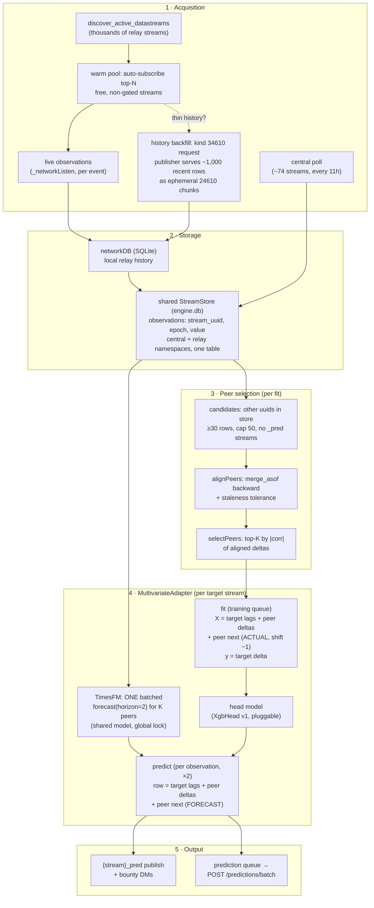

# Multivariate (Cross-Stream) Prediction: TimesFM-Stacked Features

Design and roadmap for predicting a target stream using other data streams as
exogenous features. The core idea: use TimesFM (zero-shot, already integrated)
to forecast the next values of K correlated peer streams, and feed those
forecasts as features into a trainable "head" model (XGBoost first, pluggable)
that predicts the target stream.

> Status: design/roadmap only. Nothing here is implemented yet. All file/line
> references were verified against the unified engine (post `LiteEngine`
> removal, relay + central paths both on `veda.Engine`).

---

## 1. Motivation and idea

The Satori network rewards neurons for accurate next-value predictions on data
streams (MAE scoring, both central and bounty paths). Today every stream is
predicted univariately: each `StreamModel` sees only its own
`[date_time, value, id]` history, and every active adapter (Starter, ETS, XGB,
TimesFM) reduces its input to a single `value` series.

But the relays carry thousands of streams, and many are related (crypto pairs,
markets on the same asset, upstream/downstream signals). A model that can see
correlated peer streams should beat one that cannot, especially on
near-random-walk series where the stream's own history is nearly exhausted as
a signal source.

**The stacking concept:**

```
peer streams (K, correlation-selected)
        |
        v
  TimesFM, ONE batched forecast() call     <- zero-shot, no training cost
        |
        v  K next-step forecasts
+---------------------------+
| head model (XGB v1,       |  features: target lags + peer deltas
| pluggable)                |            + peer TimesFM forecasts
+---------------------------+
        |
        v
  target stream prediction
```

Division of labor:

- **TimesFM** is the feature engine. Zero-shot means forecasting K peers costs
  inference only (~134 ms/series batched, see `timesfm/README.md` section 5),
  no per-peer training, and it scales flat as peers are added.
- **The head** is the only trained component. It learns how much each peer's
  movement actually matters for the target. It is deliberately small (tens of
  training rows today) and pluggable: XGBoost first, but nothing hard-wires it.

---

## 2. Why the code is ready for this

The unification of the relay and central paths onto `veda.Engine` removed the
main obstacle. Verified hooks:

| Fact | Where | Why it matters |
|---|---|---|
| Central (~74 streams) and relay subscriptions share one `StreamStore` (single SQLite `observations` table, uuid-namespaced) | `satoriengine/stream_store.py`, `storage/manager.py` | Peer-history candidates come for free, across both paths |
| `EngineStorageManager.getInstance()` is a process-wide singleton; `StreamStore` is thread-safe (`RLock`) and exposes `history()`, `stream_uuids()`, `row_count()` | `storage/manager.py:25` | The adapter can self-serve peer data at call time |
| Adapters are constructed with the target uuid: `self.adapter(uid=self.streamUuid)` | `engine.py:608, 620` | No `fit`/`predict` call-site changes needed to know "who am I" |
| `TimesFmAdapter` holds one shared resident model behind class-level locks | `adapters/timesfm/timesfm_adapter.py:30-32` | The multivariate adapter reuses it, never loads its own copy |
| A `MultivariateAdapter` stub already exists (unimplemented) | `adapters/multivariate/multivariate.py` | Natural home; registry key reserved by convention |
| `XgbAdapter.merge(dfs, targetColumn)` sketches multi-frame `merge_asof` alignment ("Layer 1", with TODOs about combining sources) | `adapters/xgboost/xgb.py:400` | The alignment idea is pre-sanctioned; needs a staleness tolerance added |
| Cross-stream/global models are already proposed as future work | `IMPROVEMENTS.md` section C.9 | This doc is the concrete first step |
| Registering an adapter auto-exposes it in the web settings UI via `VALID_ADAPTER_CHOICES` | `engine.py:58`, `web/routes.py` | Opt-in with zero UI changes |

---

## 3. Design

### 3.1 The predicted-covariate training scheme

The subtlety in "use TimesFM forecasts as features": at inference time the
features are forecasts of values not yet observed, so training rows need the
same feature semantics, and generating historical TimesFM forecasts for every
training timestamp x every peer would cost thousands of batched calls per
retrain.

The standard, cheap resolution (predicted covariates):

- **Training:** for each historical row t, the covariate is the peer's
  *actual* aligned value at t+1 (a `merge_asof`-aligned column, `shift(-1)`).
- **Inference:** the unknown t+1 peer value is substituted with TimesFM's
  one-step forecast.

The head learns "if peer k moves like X next step, the target moves like Y",
using perfect covariates in training; inference quality then degrades
gracefully with TimesFM's forecast error. No historical TimesFM calls are ever
needed to build the training matrix.

### 3.2 Peer selection: correlation top-K

- Candidates: every stream in the shared `StreamStore` except the target
  (spanning central + relay namespaces), filtered to a minimum row count,
  capped to the largest N candidates to bound work.
- Align each candidate onto the target's time grid (see 3.3), then compute
  Pearson correlation of **diffs** (deltas), not raw levels. Two trending
  series correlate spuriously on levels; deltas measure co-movement.
- Require a minimum overlap of valid aligned pairs (e.g. 30) so short overlaps
  do not produce lucky correlations.
- Keep peers with |corr| >= a floor (e.g. 0.15), take top K (default 5) by
  |corr|.
- Reselect periodically (e.g. after every 25 new target rows), not on every
  fit; cache the selected peer set with the saved model so restarts do not
  churn features.

### 3.3 Alignment and feature schema (v1)

Streams have different cadences and irregular timestamps. Alignment is
`merge_asof(direction='backward')` of each peer onto the target's `date_time`
grid with an explicit staleness `tolerance` (default 3x the target's median
cadence). A peer value used as a feature at target time t must have been
observed at or before t; `merge_asof` backward guarantees this (no lookahead
leakage). Values older than the tolerance become NaN.

Feature schema v1, kept deliberately small for thin data:

| Feature | Definition | Training source | Inference source |
|---|---|---|---|
| target lags | pct-change at lags [1, 2, 3, 5, 8] (subset of XGB's Fibonacci lags) | observed | observed |
| `p{k}_delta` | peer k pct-change, t-1 to t | observed (aligned) | observed (aligned) |
| `p{k}_next` | peer k pct-change, t to t+1 | **actual** aligned value (`shift(-1)`) | **TimesFM forecast**: `(forecast - lastAligned) / lastAligned` |
| label `y` | target level diff, t to t+1 | observed | (predicted) |

- Delta target mirrors `XgbAdapter` v2 (predict the diff, add
  `_lastObservedValue` back), which benchmarked ~30% better pooled MAE than a
  level target.
- Peer NaNs (stale/missing) fill with 0.0 ("no change") in both training and
  inference, so the head trains on the same fallback it will see live.
- Leakage rules, stated as invariants: every `_delta` column at row t uses
  only observations with timestamp <= t; every `_next` column equals exactly
  the quantity the inference-time forecast substitutes.

### 3.4 Adapter architecture

New opt-in adapter implementing the existing stub. Nothing enters
`AUTO_ADAPTERS`; the univariate XGB default path is untouched.

**Files (when implemented):**

| File | Change |
|---|---|
| `adapters/multivariate/heads.py` | NEW: pluggable head (`Head` interface + `XgbHead` + `HEAD_REGISTRY`) |
| `adapters/multivariate/features.py` | NEW: `alignPeers`, `selectPeers`, `buildTrainingMatrix`, `buildInferenceRow` (pure functions, unit-testable) |
| `adapters/multivariate/multivariate.py` | REWRITE the stub (its `condition()` logic is currently inverted) |
| `adapters/multivariate/__init__.py` | FIX: currently imports `StarterAdapter` (copy-paste bug) |
| `adapters/__init__.py` | guarded optional import, same pattern as TimesFM |
| `engine.py` | two lines: import + `ADAPTER_REGISTRY['multivariate']` |
| `satoriengine/stream_store.py` | one method: `count_streams_with_min_rows(min_rows)` (single `GROUP BY ... HAVING` query) |

**Pluggable head.** A minimal duck-typed interface, not a plugin system:
`fit(X, y)`, `predict(X)`, `state() -> dict` (joblib-serializable),
`fromState(state)`. `XgbHead` v1 uses fixed conservative params
(max_depth=3, n_estimators=200, learning_rate=0.05, min_child_weight=5,
subsample=0.8, eval_metric='mae'); ~60 training rows cannot support a
hyperparameter search. Swapping the head later (linear, LightGBM, MLP) is a
registry entry.

**`condition()` gates** (must return exactly 1.0 to be selected; runs on
every observation, so it must be cheap):

- available RAM < 2 GB -> 0.0 (TimesFM residency; falls back to XGB -> Starter
  via the existing `buildPreferredAdapters` chain). Deliberate asymmetry: a
  thin-RAM node is gated out entirely even though naive-covariate mode would
  run, because on such nodes univariate XGB is the better spend; the
  naive-covariate fallback exists for transient TimesFM failures, not as a
  low-RAM mode.
- target rows < 60 -> 0.0
- fewer than 2 streams with >= 30 rows in the store -> 0.0, checked via the
  new single-SQL count behind a module-level ~60s TTL cache
- any store exception -> 0.0 (never break adapter selection)

**`fit()` flow** (training queue): load candidate peer histories from the
store (capped, largest first) -> align -> reuse cached peer set or reselect ->
build matrix -> chronological 80/20 split -> fit head -> retain test split and
test MAE for `score()`/`compare()`. If no peers survive or usable rows are too
few, return `TrainingResult(-1)`; the engine logs and retries next cycle while
the previous stable model keeps serving.

**`predict()` flow and the 2-step autoregression.** `_runForecast`
(`engine.py:1154`) calls every adapter's `predict` twice, feeding the first
prediction back as a synthetic row; the shipped value is t+2. The multivariate
adapter handles this without engine changes:

- Detect the step: the synthetic row's timestamp is newer than the last stored
  epoch for the target uuid (both paths ingest before forecasting:
  `predictForRelay` and `onDataReceived` store rows first), so `depth` = count
  of rows in the input frame newer than the store's last real epoch (0 = first
  step, 1 = augmented second step).
- Peer forecasts: one batched call `forecast(horizon=2, inputs=[ctx_1..ctx_K])`
  via `TimesFmAdapter._ensureModel()` under `TimesFmAdapter._inference_lock`,
  cached per observation epoch so the two predict calls share it. Step one
  uses horizon-1 forecasts for `p{k}_next`. At the augmented step the peer's
  t -> t+1 change is not observed either, so `p{k}_delta` substitutes the
  horizon-1 forecast delta and `p{k}_next` the horizon-1 -> horizon-2 change:
  the predicted-covariate rule applied one step later, to BOTH peer columns.
- Thin peers (< 64 points, well below TimesFM's 350-point floor for being the
  *main* adapter) or TimesFM unavailable/failed: fall back to last aligned
  value for that peer. The NaN->0 convention means the head already knows this
  regime.
- Output: `{'date_time': [last_ts + median_cadence], 'pred': [lastObservedValue + head_delta]}`,
  mirroring `TimesFmAdapter._wrapPrediction`.

**Deepcopy safety.** `self.stable = copy.deepcopy(self.pilot)`
(`engine.py:610`) means the adapter instance may hold only picklable state
(head state, peer uuids/corrs, feature columns, cached test split). Never a
sqlite connection or the torch model; both are reached at call time through
the singletons.

**Persistence** (joblib at the existing `modelPath()` location):

```python
{'schema_version': 1, 'head_name': str, 'head_state': dict,
 'peer_uuids': list[str], 'peer_corrs': dict, 'feature_columns': list[str],
 'staleness_seconds': float, 'modelError': float, 'selected_at_rows': int}
```

`load()` refuses a mismatched `schema_version` and returns None, forcing a
clean retrain (same pattern as XGB's v2 gate).

**Config** (all optional, defaults in code):

```yaml
engine:
  preferred_adapter: multivariate   # the only required opt-in
  multivariate:
    head: xgboost
    top_k: 5
    min_abs_corr: 0.15
    peer_min_rows: 30
    reselect_every: 25
    max_candidates: 50   # cap on peer histories loaded per fit (largest first)
```

---

## 4. End-to-end data flow

Big picture (renders in GitHub / IDE markdown preview):



Detailed version with code entry points:

```
            NOSTR RELAYS                                CENTRAL (mundo)
   thousands of streams; each relay              full history in Postgres, served
   retains only the LATEST observation           as latest-snapshot batches
   per stream (kind 34601, replaceable)
            |                                              |
   subscribe_datastream + live listen             pollObservationsForever
   (_networkListen, per observation)              (one thread, every 11h,
            |                                      ~74 streams sequentially)
            v                                              |
   _networkProcessObservation                              |
            |                                              |
            v                                              v
   networkDB (SQLite)                             batch_to_stream_frames
   full LOCAL history, but only                            |
   from subscribe-time forward                             |
            |                                              |
            +---------------------+    +-------------------+
                                  v    v
                    shared StreamStore (engine.db)
                 observations(stream_uuid, epoch, value, id)
                 central + relay uuid namespaces, one table
                                  |
        +-------------------------+--------------------------+
        | target history          | peer histories            |
        | (this StreamModel's     | (any other uuids in the   |
        |  own data)              |  store with enough rows)  |
        v                         v                           |
  StreamModel (target)     alignPeers: merge_asof backward,   |
  _modelLock, event-       staleness tolerance, onto the      |
  driven per observation   target's date_time grid            |
        |                         |                           |
        v                         v                           |
  MultivariateAdapter  <----- selectPeers: top-K by |corr|   -+
        |                     of aligned deltas
        |
        |-- fit() [single-worker training queue]
        |     X = target lags + p{k}_delta + p{k}_next(ACTUAL, shift(-1))
        |     y = target delta t -> t+1
        |     head.fit(X, y)   [XgbHead v1, pluggable]
        |
        |-- predict() [per observation, called twice by _runForecast]
        |     peer contexts --> TimesFM: ONE batched forecast(horizon=2)
        |     |                 [shared model, process-wide inference lock]
        |     v
        |     row = target lags + p{k}_delta + p{k}_next(FORECAST)
        |     pred = lastObservedValue + head.predict(row)
        v
  {'date_time', 'pred'}
        |
        +--> relay: {stream}_pred publish + bounty DMs
        +--> central: prediction queue -> POST /api/v1/predictions/batch
```

---

## 5. Operational design: acquisition, cycling, contention

The questions this section answers were the open "how does it actually run"
gaps: how peer data is acquired, whether targets wait on each other, and
whether central predictions get blocked. All claims below were verified
against the code.

### 5.1 Peer data acquisition: the hard constraint

**There is no way to fetch a stream's history from relays, by protocol
design.** Observations are published as NIP-01 parameterized-replaceable
events (kind 34601, `d=stream_name`, `satori_nostr/models.py:512-521`), so a
relay stores exactly ONE observation per (publisher, stream): the newest. Each
publish overwrites the previous event. Consequences:

- The live subscription filter (`client.py:1547`) has no `since`/`limit`; a
  fresh subscriber receives the current latest observation plus everything
  published from that moment forward. Nothing older exists on the relay.
- `get_last_observation(stream_name)` (`client.py:809`) is the only one-shot
  query, and it returns a single event.
- `_backfillRelayHistory` (`start.py:1146`), despite the name, reads the
  neuron's own local `networkDB` SQLite (history captured live while
  subscribed), not relays.
- strfry's negentropy sync is enabled in the embedded relay config but unused
  by application code, and it could only sync what relays hold anyway (the
  latest event).

**So "cycling through the relay streams" is necessarily
discover -> subscribe -> accumulate -> use.** A peer stream becomes a usable
feature only after the node has listened to it long enough:

| Peer cadence | Time to MV_PEER_MIN_ROWS (30) | Time to useful overlap (~60) |
|---|---|---|
| 10 min | ~5 h | ~10 h |
| 1 h | ~30 h | ~2.5 d |
| daily | ~1 month | ~2 months |

**Cost and access per stream** (enforced by the publisher at delivery time,
not at subscribe time):

- Free unencrypted streams: `subscribe_datastream` + listen; no payment, no
  approval. These are the v1 candidate pool.
- Paid streams (`price_per_obs > 0`): delivered NIP-04-encrypted per
  subscriber, gated on payment-channel state (`_channelPayForObservation`,
  `start.py:739`). Every peer observation costs real sats; feature acquisition
  has a marginal cost that the accuracy gain must beat. Exclude from the
  auto-pool in v1.
- Approval-gated streams (`approval_required=True`): need a kind-34609 access
  request and a manual producer-side approval; the reconcile loop does not
  auto-request. Exclude from the auto-pool.
- The combined publications + subscriptions cap `getMaxTotalStreams()`
  (`network_db.py:23`) bounds how many peers a node can warm; the auto-pool
  must leave headroom for the user's own subscriptions.

**Candidate hygiene**: exclude `_pred` streams (other nodes' predictions) from
the peer pool to avoid prediction-of-prediction circularity, and note that the
same real-world series can appear under both a central uuid and a relay uuid
(near-duplicate peers with corr ~ 1.0, harmlessly wasting a peer slot; a
max-pairwise-correlation filter can dedupe later).

**Closing the history gap (future mechanisms, in rough order of leverage):**

1. **Auto-subscribe warm pool**: the reconcile loop subscribes to the top-N
   active, free, non-gated streams from `discover_active_datastreams`,
   accumulating history in the background so features are ready when a target
   wants them. Cheap, uses only existing primitives.
2. **Publisher history protocol**: a new request/response over the relays
   where the producer serves observation ranges from its own networkDB (it
   has full history of everything it published). The only producer-initiated
   primitive today is `send_observation_to_subscriber` (`client.py:634`),
   single observation, gap-recovery only. Concrete sketch below.
3. **Central as history oracle**: central-lite's Postgres holds full history
   for its ~74 streams; a backfill endpoint would make central peers deep
   immediately (relay peers unaffected).
4. **Protocol change**: publish observations as non-replaceable kinds (or
   per-seq `d` tags) so relays retain history, plus a paginated fetch. Largest
   change, shifts storage burden onto relays.

#### Sketch: publisher-served history over relay DMs (option 2)

Why this is the right lever: the relays cannot serve history (replaceable
events), but the *publishing neuron* keeps everything it ever published in its
own networkDB (`_networkPublishObservation` saves each observation locally
under its own pubkey before broadcasting). The transport and crypto plumbing
for encrypted request/response DMs already exists: kind-34609 access requests
(`request_access`, `client.py:1009`) and bounty prediction DMs
(`submitPrediction`) are exactly this shape.

**Protocol (two new event kinds):**

```
requester                     relays                      publisher
    |                            |                            |
    |-- KIND_HISTORY_REQUEST --->|--------------------------->|
    |   (34610, NIP-04 DM,       |         validate: my stream?
    |    d = request_id)         |         access ok? rate ok?
    |                            |                            |
    |                            |    read range from networkDB
    |                            |    chunk + compress
    |                            |                            |
    |<-- KIND_HISTORY_CHUNK -----|<---------------------------|
    |    (24610 EPHEMERAL,       |    one event per chunk:
    |     NIP-04 DM) x N         |    {request_id, seq_from, seq_to,
    |                            |     chunk_i, chunk_n, rows_b64}
    |                            |                            |
reassemble -> verify seq continuity -> save_observation() dedup
    -> networkDB -> _backfillRelayHistory -> engine StreamStore
```

- **Request** (kind 34610, parameterized-replaceable with `d=request_id`):
  `{stream_name, from_seq | from_ts, max_rows, format_version}`, NIP-04
  encrypted to the publisher. Being a stored kind means the publisher can
  answer after coming online; only the latest request per `d` is retained,
  which is the correct semantics for retries.
- **Recent-window by default, not full history.** No consumer in the engine
  can use unbounded depth: TimesFM reads at most its 512-point context, the
  head's training matrix is bounded by overlap with the target's own history,
  and correlation selection needs ~30-60 overlapping points. So the neuron's
  default request is simply the last ~1,000 rows (2x TimesFM context, ~2
  chunks); `from_seq` paging exists for the rare deeper pull (offline
  backtests, archival), not the normal path. This keeps publisher-side load
  and abuse caps trivial.
- **Response chunks** (kind 24610, **ephemeral** range 20000-29999): relays
  forward but never store them (the embedded strfry already configures
  `ephemeralEventsLifetimeSeconds = 300`), so bulk history transits the relay
  without bloating its database or fighting replaceable-overwrite semantics.
  Rows as compact JSON `[[seq, observed_at, value], ...]`, zlib + base64;
  ~500 rows/chunk stays comfortably under typical relay event-size limits
  (~64 KB); chunk headers carry `request_id, chunk_i, chunk_n` for reassembly.
- **Ingest on the requester**: reassemble, check seq continuity, then insert
  through the existing `save_observation` path (dedup on
  `(stream_name, provider_pubkey, seq_num)` already built in), then the
  existing `_backfillRelayHistory` flow pushes it into the engine
  `StreamStore`. No new storage code.

**Access and abuse rules** (publisher-side, mirroring live-delivery rules):

- Free unencrypted streams: serve, but cap rows per request (e.g. 2,000,
  comfortably above the recent-window default) and per-pubkey cooldown (e.g.
  one request per stream per hour).
- Paid streams: serve only up to what the subscriber has paid for
  (`subscriber_access.last_paid_seq`), or price history as a one-off channel
  payment. Approval-gated: serve only `approved_subscribers`.
- The publisher answering is best-effort: requester retries with backoff and
  proceeds with whatever accumulated live history it has if no answer.

**Things to get right:**

- The private relay's strfry write policy (`_render_private_policy`,
  `relay_manager.py:693`) allow-lists event kinds; 34610/24610 must be added
  or requests die at the publisher's own relay door.
- Trust: served history is self-reported by the publisher and unverifiable
  against relay events (the originals were overwritten). That is the same
  trust model as the live feed, so acceptable, but backfilled rows should be
  marked (`event_id = NULL` or a `backfilled` flag) in case scoring ever needs
  to distinguish live-witnessed data.
- Both parties must share at least one relay and the publisher must be online
  eventually; the reconcile loop is the natural place to issue and retry
  requests for warm-pool streams whose history is thin.
- **No-response is not discard.** Backfill is an accelerator, not a gate. If
  the publisher never answers (retries with backoff exhausted), the stream
  stays subscribed and keeps accumulating live rows; a partial response (200
  of 1,000 rows) is likewise kept, since candidacy needs only ~30-60
  overlapping points. "Moving on" happens at the selection layer for free:
  correlation top-K simply ranks thin peers below deeper ones until they
  catch up. Actual unsubscribe/eviction has a different trigger: the stream
  goes dead (no live observations for many cadences) or the warm pool hits
  the `getMaxTotalStreams()` cap and a better candidate needs the slot.

This turns the warm-pool cold-start from "wait ~2 months for a daily stream"
into "one request/response round trip", and it also fixes ordinary gap
recovery after neuron downtime, which today loses observations permanently.

### 5.2 Cycling: do targets wait on each other?

**No. Prediction is event-driven, not round-robin.** Each target stream is an
independent `StreamModel` with its own `_modelLock` (`engine.py:536, 581`);
predictions for different streams run concurrently (relay observations fan out
via `asyncio.to_thread` onto a thread pool; sequential only per relay
connection). Selecting a target does not make other targets "wait out".

**Secondary-stream cycling is a local, per-fit operation, not a network one.**
When a target's `fit()` runs, it reads candidate peer histories straight from
the shared `StreamStore` (capped at `MV_MAX_CANDIDATES`, largest first),
aligns, and correlation-ranks them. Cycling through peers never touches the
relays at fit time; the relays were already "cycled" implicitly by the warm
pool accumulating history.

Two places where turns ARE taken (existing behavior, unchanged):

- **Training**: the single-worker training queue fits one stream at a time, so
  targets take turns retraining. A target's fit blocks only that same target's
  predictions (same `_modelLock`), never other streams'.
- **Same stream with itself**: an in-flight predict blocks that stream's next
  observation. The multivariate predict is heavier (alignment + batched
  TimesFM + two autoregression steps), which is fine at practical cadences but
  worth measuring in the testground.

**Shared peers**: multiple targets will often select the same popular peers.
The per-epoch peer-forecast cache should be process-wide keyed by
(peer_uuid, last_epoch), so K peers shared by M targets cost one TimesFM
forecast per epoch, not M.

### 5.3 Central-path contention: are central predictions blocked?

**Not meaningfully.** Central and relay streams key disjoint `StreamModel`s
(different uuid5 namespaces), each with its own lock; `_engineLock`
(`start.py:72`) guards only model-registry creation, not predicts. The central
poll thread processes its ~74 streams sequentially and independently.

The two global choke points where a multivariate adapter adds pressure:

1. **TimesFM inference lock** (`timesfm_adapter.py:32`): process-wide, so a
   batched K-peer forecast holds it for the whole call, and every other
   TimesFM-based predict (central or relay) queues behind it. Measured
   figures: single call ~0.5 s, batch-of-32 ~4.3 s (~134 ms/series) on 2 vCPU;
   a K<=10 call is well under ~1.5 s. Queueing adds latency, never deadlock.
   The latency budget that matters is bounty scoring's late cutoff
   (`scoring/mae.py` disqualifies predictions received after
   prev_observed_at + window x 0.9), so TimesFM queue depth should be
   monitored if many multivariate targets fire simultaneously.
2. **Single training worker**: multivariate fits are heavier (peer loading +
   alignment). They queue like all other fits; prediction latency is
   unaffected except for the same target while it fits.

If TimesFM lock contention ever becomes real (many targets, sub-minute
cadences), the escape hatch is a small peer-forecast service: collect due
peers across targets for a tick and issue one large batched call, which is
exactly the batching pattern recommended in `timesfm/README.md` section 5.

### 5.4 Other things thought through

- **Peer death / silence**: staleness tolerance turns a silent peer's aligned
  values into NaN -> 0.0 ("no change"), the same regime the head saw in
  training; periodic reselection (every 25 target rows) rotates dead peers
  out.
- **Selection drift and restarts**: the chosen peer set persists with the
  saved model (uuids + correlations), so restarts do not churn features
  mid-schema; `schema_version` gates any feature redefinition.
- **Resource cost of the warm pool**: each extra subscription is one more row
  stream into networkDB + StreamStore (trivial per stream) and one more relay
  filter; the binding constraints are `getMaxTotalStreams()` and, for paid
  streams, sats.
- **Feedback loops**: excluding `_pred` streams from candidates prevents
  direct prediction-of-prediction loops; using other nodes' raw observations
  is safe because observations are ground truth, not model output.

---

## 6. Roadmap

Phased so each step is independently verifiable and the whole thing stays
opt-in until it proves itself.

1. **Pure functions first.** `features.py` + `heads.py` with unit checks:
   leakage assertions (every `_delta` input at row t observed <= t; `_next`
   columns equal the substitution target), staleness-tolerance behavior,
   correlation-on-deltas vs levels.
2. **Adapter + wiring.** Rewrite the stub, fix the `__init__.py` bug, registry
   entry, config keys, `count_streams_with_min_rows`. Lifecycle checks:
   `copy.deepcopy(fitted_adapter)` works, joblib save -> load round trip,
   `load` refuses wrong schema.
3. **Backtest testground: the go/no-go gate.** New
   `testground/multivariate_testground.py` (pattern:
   `engine_testground.py` + `docs/engine/timesfm/bench.py`). Walk-forward the
   last ~20 points of each of the 80 real streams in `engine-lite/db/engine.db`
   comparing pooled MAE + per-stream win rate of:
   (a) naive last-value, (b) univariate `XgbAdapter`,
   (c) multivariate with naive peer covariates (last value as the "forecast"),
   (d) multivariate with TimesFM peer covariates.
   Critical: variant (d) must substitute real forecasts at every step, never
   actual peer values, or results are optimistic. (c) vs (d) isolates exactly
   what TimesFM adds over "peers exist at all". Also measure the batched
   TimesFM latency per cycle here.
4. **Dev-neuron integration.** `preferred_adapter: multivariate` on a dev
   node: selection kicks in at >= 60 rows with peers present, relay
   predictions ship end-to-end to `{stream}_pred`, clean fallback to XGB when
   the store is thin or RAM-gated.
5. **Peer acquisition (the warm pool).** Auto-subscribe to top-N active,
   free, non-approval-gated streams from `discover_active_datastreams` in the
   reconcile loop, respecting `getMaxTotalStreams()`, so feature candidates
   are not limited to what the user happened to subscribe to. This is the
   "cycle through the relay streams" part at full scale; see section 5.1 for
   why history cannot be fetched retroactively and must be accumulated.
6. **Future work.**
   - Publisher history protocol or central backfill endpoint (section 5.1
     options 2-3) to eliminate the warm-up wait.
   - TimesFM covariates API (`forecast_with_covariates`): let TimesFM itself
     consume peer series instead of stacking, and compare against the head.
   - Global/pooled models across streams of one class (IMPROVEMENTS.md C.9):
     one model trained on all fast-crypto streams with stream-id as a feature.
     Complementary to, not competing with, this design.
   - Cross-target peer-forecast service if TimesFM lock contention shows up
     (section 5.3).

---

## 7. Risks and open questions

1. **Train/serve covariate mismatch (highest risk).** The head trains on
   actual peer t+1 deltas but consumes TimesFM forecasts at inference. If
   forecast error is high, the `_next` features degrade toward noise.
   Mitigation: the always-observed `_delta` features stay alongside, so the
   head never depends solely on forecasts. Adjudicated empirically by
   testground (c) vs (d).
2. **Data thinness.** ~90-point daily central streams give ~60 usable
   training rows. Even with conservative fixed params, XGB can overfit, and it
   is genuinely uncertain multivariate beats univariate at this scale (recall:
   naive last-value currently beats everything on these streams, see
   `timesfm/README.md` section 4). The backtest is the gate; opt-in placement
   means a "not yet better" result costs nothing. The design should win more
   clearly on denser, sub-daily relay streams.
3. **Singleton coupling and `condition()` cost.** `condition()`/`fit()`
   reaching `EngineStorageManager.getInstance()` assumes the engine created it
   first (true in prod for both paths); tests must patch the store accessor.
   The per-observation store count is one SQL query behind a TTL cache, but
   worth profiling on nodes with thousands of relay streams.
4. **Peer availability is subscribe-forward only.** Relays hold only the
   latest observation per stream (replaceable events, section 5.1), so peer
   history exists only from the moment this node subscribed. Correlation
   top-K can only choose among streams with accumulated local history; until
   the warm pool (roadmap 5) has run for a while, feature quality depends on
   what the node already subscribes to, and daily-cadence peers take ~2
   months to become useful.
5. **TimesFM head-of-line blocking.** The process-wide inference lock means a
   batched K-peer call delays every other TimesFM predict. Bounded (~1.5 s at
   K<=10) and harmless at current cadences, but it interacts with bounty
   scoring's late cutoff; monitor queue depth as multivariate targets
   multiply (section 5.3).
